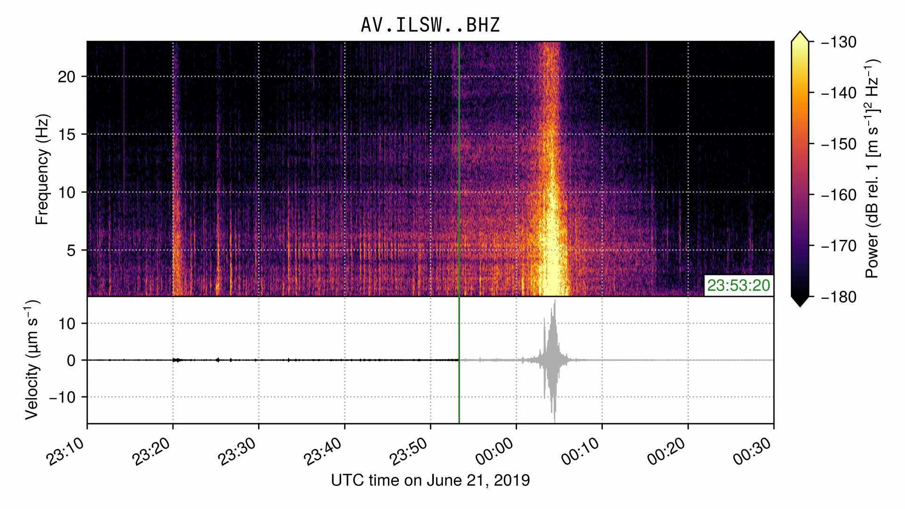

# sonify

[](https://sonify.readthedocs.io/)

This tool "squeezes" seismic or infrasound signals into audible frequencies and
creates animated spectrograms to accompany the audio. Data are pulled from the
[IRIS DMC](https://ds.iris.edu/ds/nodes/dmc/).



## Quickstart

1. Prepare environment
   ```
   conda create -n sonify -c conda-forge colorcet ffmpeg obspy
   conda activate sonify
   ```

2. Obtain and install
   ```
   git clone https://github.com/liamtoney/sonify.git
   cd sonify
   pip install -e .
   ```

3. Run
   ```python
   python
   >>> from sonify import sonify
   ```

## Example

To make a movie of the infrasound signal generated by a massive avalanche
occurring in Alaska on 22 May 2016, sped up by a factor of 400:

```python
from sonify import sonify
from obspy import UTCDateTime

sonify(
    network='TA',
    station='O20K',
    channel='BDF',
    starttime=UTCDateTime(2016, 5, 22, 7, 45),
    endtime=UTCDateTime(2016, 5, 22, 8, 15),
    speed_up_factor=400,
    fps=10,
    db_lim=(40, 100),
)
```

The result is a 4K video file named `TA_O20K_BDF_400x.mp4`. A screenshot of the
movie is shown at the top of this README.
